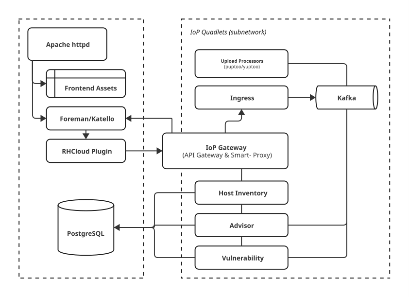

# Architecture

Insights services are built and packaged as container images. The containers are defined as [container systemd units](https://docs.podman.io/en/latest/markdown/podman-systemd.unit.5.html) and are run by systemd using podman. Additional systemd units, such as timers, network, and (optional) volumes, are created to support the runtime.

The upstream Insights container images are built by GitHub Actions in their respective repositories ([example](https://github.com/RedHatInsights/iop-gateway/blob/master/.github/workflows/container-publish.yaml) of container image build and publish action). Each service defines its [Containerfile](https://github.com/containers/common/blob/main/docs/Containerfile.5.md)/[Dockerfile](https://docs.docker.com/reference/dockerfile) in its repository. Red Hat Universal Base Images ([UBI](https://catalog.redhat.com/en/software/base-images)) are used as base images.

## Overview



Insights on Premises services are deployed as containers on the same machine as Foreman.
The services run in their own network defined by a [network unit](https://www.freedesktop.org/software/systemd/man/latest/systemd.network.html) (see also [podman network](https://docs.podman.io/en/latest/markdown/podman-network.1.html)).
The routing to the services is facilitated by a custom IoP Gateway, which acts as an API gateway and proxy to Foreman’s APIs.
Requests to Insights services are proxied with Foreman's [RH Cloud plugin](https://github.com/theforeman/foreman_rh_cloud/).
See [Gateway](./gateway.md) for more details.

## Quadlets and Configuration

Quadlets are [systemd container units](https://docs.podman.io/en/latest/markdown/podman-systemd.unit.5.html) that run containers with podman. Systemd transforms the container unit files into `podman run` commands and runs them as systemd services.

The default system location of the container unit files is:

```
/etc/containers/systemd/
```

The unit files, including timers and network, are generated by Foreman Installer via [puppet-iop](https://github.com/theforeman/puppet-iop/). Each service has a Puppet module defined in [manifests](https://github.com/theforeman/puppet-iop/tree/master/manifests). The Puppet modules define image names through parameters that can be overridden with Hiera (a Puppet variable configuration method).

Here is an example of Hiera configuration that could be used to override image names when using the installer.

```
iop::core_kafka::image: 'quay.io/strimzi/kafka:latest-kafka-3.7.1'
iop::core_engine::image: 'quay.io/iop/insights-engine:latest'
iop::core_gateway::image: 'quay.io/iop/gateway:latest'
iop::core_host_inventory::image: 'quay.io/iop/host-inventory:latest'
iop::core_host_inventory_frontend::image: 'quay.io/iop/host-inventory-frontend:latest'
iop::core_ingress::image: 'quay.io/iop/ingress:latest'
iop::core_puptoo::image: 'quay.io/iop/puptoo:latest'
iop::core_yuptoo::image: 'quay.io/iop/yuptoo:latest'
iop::service_advisor::image: 'quay.io/iop/advisor-backend:latest'
iop::service_advisor_frontend::image: 'quay.io/iop/advisor-frontend:latest'
iop::service_remediations::image: 'quay.io/iop/remediations:latest'
iop::service_vmaas::image: 'quay.io/iop/vmaas:latest'
iop::service_vulnerability::image: 'quay.io/iop/vulnerability-engine:latest'
iop::service_vulnerability_frontend::image: 'quay.io/iop/vulnerability-frontend:latest'
```

:::note
The Foreman Installer that uses Puppet might soon be transitioned to foremanctl that uses Ansible.
:::

Insights services are primarily configured through environment variables. Secret tokens, such as passwords, are created with `podman secret` and are attached to their respective environment variables.

The services use a naming convention that separates core services (prefixed `iop-core-`) from general services (prefixed `iop-service-`). The core services are those that support Insights, such as the IoP gateway, Kafka, and similar components. The convention is used in systemd service names, container names, and hostnames.

## Kafka

[Apache Kafka](https://kafka.apache.org/) is used as an event-streaming platform and as the main inter-service communication and queuing method. Insights services that process systems’ data use Kafka topics to evaluate the data and provide results.

Upstream Insights on Premises uses a [Strimzi](https://strimzi.io/) container image of Apache Kafka. Kafka runs in a single container and uses [KRaft mode](https://developer.confluent.io/learn/kraft/) (instead of an additional coordinator such as ZooKeeper).

```
quay.io/strimzi/kafka:latest-kafka-3.7.1
```

:::note
Satellite uses [Red Hat Streams for Apache Kafka](https://access.redhat.com/products/streams-apache-kafka) instead of Strimzi, with the image `registry.redhat.io/amq-streams/kafka-38-rhel9` (see the [Red Hat catalog](https://catalog.redhat.com/en/software/containers/amq-streams/kafka-38-rhel9/67039fc45e3bf84c5008903a) entry).
:::

The Kafka instance runs on the default port `9092` on host `iop-core-kafka`. The instance uses a named volume `iop-core-kafka-data` mounted at `/var/lib/kafka/data` to store data for persistence. This volume can be backed up.

Kafka topics are checked for existence and set up once by an initialization script, as defined in the puppet-iop [kafka init script](https://github.com/theforeman/puppet-iop/blob/master/files/kafka/init).

## PostgreSQL Database

Insights services use PostgreSQL databases for storing permanent data. On premises, the services use the same PostgreSQL instance as Foreman. Isolation is achieved by using separate databases for each Insights service.

The connection to the database instance is handled by Unix sockets mounted into the containers as volumes. Note that the services should also be able to handle TCP connections. Each service that requires a database has it provisioned by Foreman Installer (via [puppet-iop](https://github.com/theforeman/puppet-iop/tree/master/manifests)). User and password are provided to the service containers via environment variables through Podman secrets, including the connection information (e.g. socket or hostname). The database user has ownership of its database and does not have the `SUPERUSER` role.

Syndication of host data from Host Inventory is provided through PostgreSQL’s [Foreign Data Wrapper](https://www.postgresql.org/docs/current/postgres-fdw.html) (FDW; previously dblink). Services that require host data have an inventory.hosts table linked to the corresponding table or view in Host Inventory. The FDW link is provisioned by the puppet-iop [`postgresql_fdw` module](https://github.com/theforeman/puppet-iop/blob/master/manifests/postgresql_fdw.pp).

:::note
The FDW setup might be replaced by an event-based system that uses Kafka messages to store service-specific host data.
:::

## Host Inventory

[Host Inventory](https://github.com/RedHatInsights/insights-host-inventory) is an Insights service dedicated to capturing all host-related data. Most Insights services depend on Host Inventory and react (evaluate hosts) to Kafka events produced by Inventory on the `platform.inventory.events` topic. The Insights client depends on the Inventory service for host registration and status.

Unlike the hosted variant, host IDs are aligned with their subscription IDs (from the subscription manager).

## Insights Client

The Insights client is a Python-based command-line tool installed on managed hosts that provides essential data from hosts to the Insights ecosystem. The client handles host registration, data collection using predefined collectors, archiving the results, and sending them to Insights via Ingress for processing. The client is composed of two components: [insights-client](https://github.com/RedHatInsights/insights-client)—a thin wrapper—and [insights-core](https://github.com/RedHatInsights/insights-core), which contains the collectors and business logic. Collector updates are delivered via Python eggs that are signed and verified with GPG.

:::note
The insights-client is being deprecated and replaced by [`rhc`](https://github.com/RedHatInsights/rhc).
:::

The client uses the existing subscription (RHSM) state to [automatically configure](https://github.com/RedHatInsights/insights-core/blob/master/insights/client/auto_config.py) the base URL to Insights via Foreman (proxy) and the certificate used for authentication. The default location of the RHSM certificate is `/etc/pki/consumer/`, where `key.pem` and `cert.pem` can be found.

An example base URL:

```
https://foreman.example.com/redhat_access/r/insights/
```
