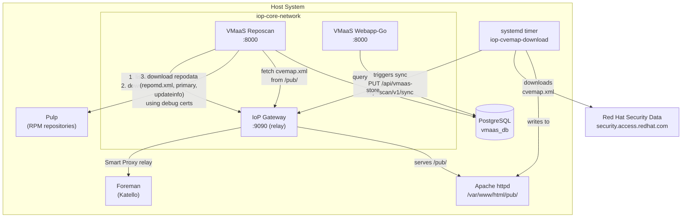

# VMaaS

[VMaaS](https://github.com/RedHatInsights/vmaas) (Vulnerability Metadata as a Service) scans RPM repositories and imports CVE metadata to provide vulnerability data for the [Vulnerability](https://github.com/RedHatInsights/vmaas) service. It consists of two containers: `iop-service-vmaas-reposcan` (a processor that syncs repository and CVE data) and `iop-service-vmaas-webapp-go` (an API backend that exposes the ingested data for querying by the Vulnerability service).

## Overview



VMaaS Reposcan periodically synchronizes two kinds of data: RPM repository metadata from Pulp and CVE metadata from Red Hat's security data. The webapp-go component queries the resulting database to answer vulnerability evaluation requests from the Vulnerability service.

## Repository Sync (Reposync)

Reposync retrieves RPM repository metadata from Foreman's content management system (Katello/Pulp). In IoP, the reposcan container communicates with Katello through the IoP Gateway's bidirectional Smart Proxy relay on port `9090`.

The sync follows these steps:

1. **List organizations** — Reposcan calls the Katello API to enumerate all Foreman organizations:
  ```
   GET /katello/api/v2/organizations
  ```
2. **List repositories** — For each organization, reposcan queries all Red Hat-marked yum repositories:
  ```
   GET /katello/api/v2/repositories?organization_id=<id>&search=redhat=true&full_result=true
  ```
   Only repositories with `content_type: yum` are processed. The response includes the Pulp repository URL in the `full_path` field.
3. **Download debug certificates** — For each organization, reposcan downloads a debug certificate (also known as an access certificate) that grants access to the organization's content in Pulp:
  ```
   GET /katello/api/v2/organizations/<id>/download_debug_certificate
  ```
4. **Download repository metadata** — Using the debug certificates, reposcan connects directly to Pulp (bypassing the gateway) to download repository metadata files: `repomd.xml`, `primary.xml`, and `updateinfo.xml`. The metadata is parsed to extract package and errata information.
5. **Store per organization** — Repository data is stored in the database per organization. Systems are evaluated within the context of the organization they belong to.

:::note
Reposcan downloads metadata directly from Pulp using the URLs and certificates obtained from the Katello API. The gateway is only used for the Katello API calls, not for the actual repository content.
:::

The Katello connection is configured through the following environment variables:


| Variable           | Default                        | Description                              |
| ------------------ | ------------------------------ | ---------------------------------------- |
| `KATELLO_URL`      | `http://iop-core-gateway:9090` | Katello API base URL (via gateway relay) |
| `KATELLO_API_USER` | `admin`                        | Katello API username                     |
| `KATELLO_API_PASS` | `changeme`                     | Katello API password                     |


The Katello CA certificate is mounted into the container at `/katello-server-ca.crt` via the Podman secret `iop-service-vmaas-reposcan-client-ca-cert`.

## CVE Map (cvemap.xml)

The CVE map provides Red Hat-specific CVE metadata (severity, CVSS scores, CWE identifiers, affected products). It is delivered to VMaaS in two stages: first the file is downloaded to the Foreman host, then reposcan imports it.

### Download to Host

A systemd timer (`iop-cvemap-download.timer`) runs every 24 hours (configurable via `iop_cvemap_downloader_timer_interval`) and executes a download script that fetches `cvemap.xml` from Red Hat's security data:

```
https://security.access.redhat.com/data/meta/v1/cvemap.xml
```

The file is placed at a location served by Apache httpd:

```
/var/www/html/pub/iop/data/meta/v1/cvemap.xml
```

When the download script detects that the file has been updated, it triggers a full VMaaS sync through the gateway using mTLS with the Foreman client certificate:

```
PUT https://localhost:24443/api/vmaas-reposcan/v1/sync
```

The trigger is retried up to 5 times with exponential backoff if the gateway is not yet available.

The timer, service, and path units are managed by the foremanctl [`iop_cvemap_downloader`](https://github.com/theforeman/foremanctl/tree/master/src/roles/iop_cvemap_downloader) role, or the legacy [puppet-iop `cvemap_downloader`](https://github.com/theforeman/puppet-iop/blob/master/manifests/cvemap_downloader.pp) class.

The foremanctl role provides the following configuration variables:

| Variable | Default | Description |
|----------|---------|-------------|
| `iop_cvemap_downloader_base_url` | `https://security.access.redhat.com/data/meta/v1/cvemap.xml` | Source URL for the CVE map |
| `iop_cvemap_downloader_timer_interval` | `24h` | Interval between downloads |
| `iop_cvemap_downloader_output_dir` | `/var/www/html/pub` | Base output directory |
| `iop_cvemap_downloader_relative_path` | `iop/data/meta/v1/cvemap.xml` | Relative path under the output directory |

#### Disconnected Environments

In disconnected (air-gapped) environments, `cvemap.xml` must be copied manually to:

```
/var/lib/foreman/cvemap.xml
```

A systemd path unit (`iop-cvemap-download.path`) watches this file for changes. When the file is modified, it triggers the download service, which copies the file to the public location and triggers the VMaaS sync.

### Import by Reposcan

Reposcan fetches `cvemap.xml` from the IoP Gateway, which serves the file from Apache's public directory via the Smart Proxy relay:

```
http://iop-core-gateway:9090/pub/iop/data/meta/v1/cvemap.xml
```

:::note
The `iop-core-gateway` domain is only avaiable from the iop container network.
:::

The import process checks the `Last-Modified` header against the last known timestamp in the database. If the file is newer, it downloads and parses the XML, extracting CVE data including threat severity, CVSS v2/v3 scores, CWE identifiers, published and modified dates, and descriptions. The data is stored in the `vmaas_db` database.

The CVE map URL is configured via the `REDHAT_CVEMAP_URL` environment variable.

## Configuration

### Reposcan Environment Variables


| Variable                | Default                                                        | Description                                         |
| ----------------------- | -------------------------------------------------------------- | --------------------------------------------------- |
| `SYNC_REPO_LIST_SOURCE` | `katello`                                                      | Source for the repository list (`katello` or `git`) |
| `SYNC_REPOS`            | `yes`                                                          | Enable repository metadata sync                     |
| `SYNC_CVE_MAP`          | `yes`                                                          | Enable CVE map sync                                 |
| `SYNC_CPE`              | `no`                                                           | Enable CPE dictionary sync                          |
| `SYNC_CSAF`             | `no`                                                           | Enable CSAF advisory sync                           |
| `SYNC_RELEASES`         | `no`                                                           | Enable RHEL release version sync                    |
| `SYNC_RELEASE_GRAPH`    | `no`                                                           | Enable RHEL release graph sync                      |
| `KATELLO_URL`           | `http://iop-core-gateway:9090`                                 | Katello API base URL                                |
| `REDHAT_CVEMAP_URL`     | `http://iop-core-gateway:9090/pub/iop/data/meta/v1/cvemap.xml` | CVE map download URL                                |
| `PROMETHEUS_PORT`       | `8085`                                                         | Prometheus metrics port                             |


### Webapp-Go Environment Variables


| Variable               | Default                                   | Description              |
| ---------------------- | ----------------------------------------- | ------------------------ |
| `REPOSCAN_PUBLIC_URL`  | `http://iop-service-vmaas-reposcan:8000`  | Reposcan public API URL  |
| `REPOSCAN_PRIVATE_URL` | `http://iop-service-vmaas-reposcan:10000` | Reposcan private API URL |


### Database

Both containers connect to the `vmaas_db` PostgreSQL database as user `vmaas_admin`. Database credentials are supplied through Podman secrets. See [Database Topology](../architecture/index.md#database-topology) for details.
